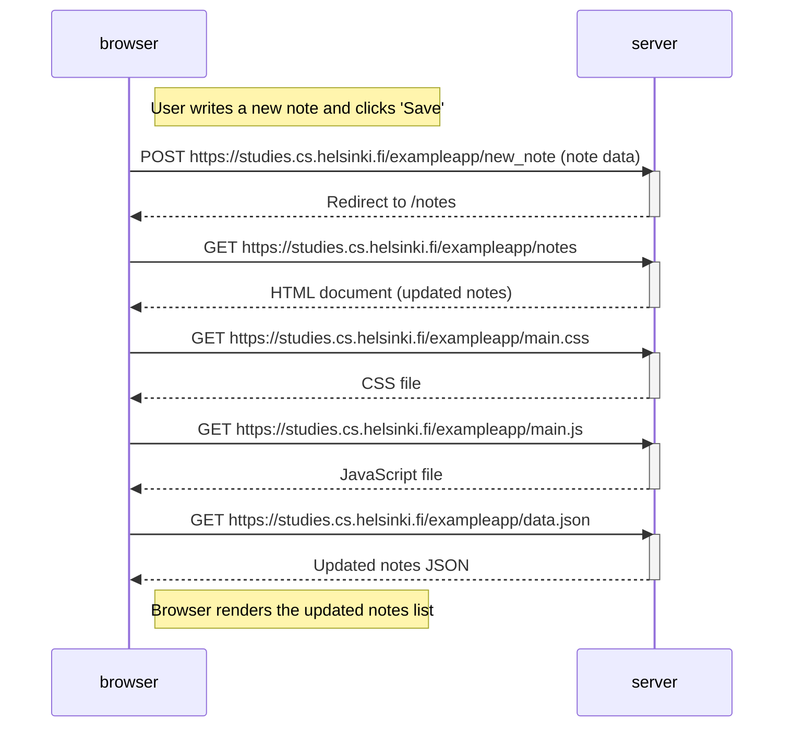
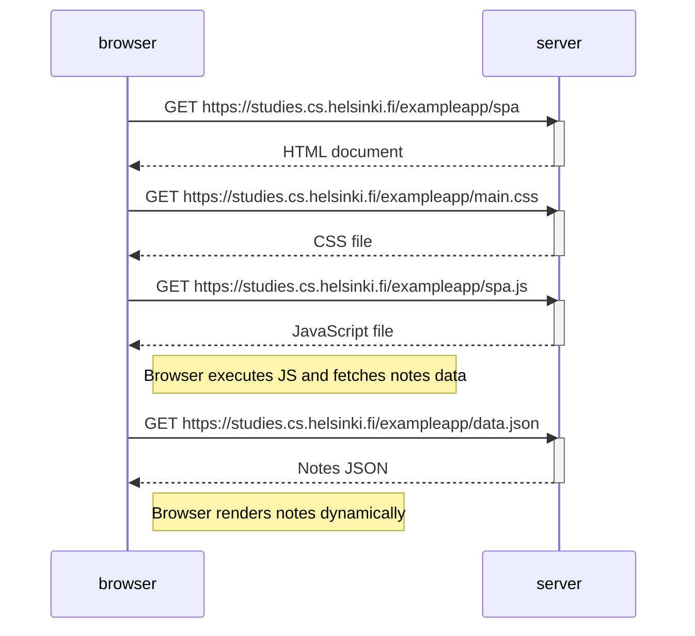
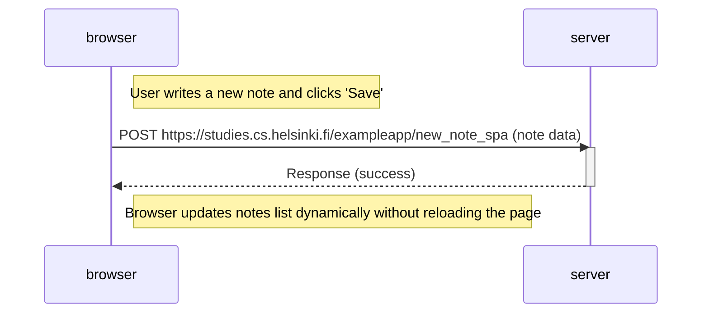

## Exercise 0.4: New Note Diagram

```mermaid
sequenceDiagram
    participant browser
    participant server

    Note right of browser: User writes a new note and clicks 'Save'

    browser->>server: POST https://studies.cs.helsinki.fi/exampleapp/new_note (note data)
    activate server
    server-->>browser: Redirect to /notes
    deactivate server

    browser->>server: GET https://studies.cs.helsinki.fi/exampleapp/notes
    activate server
    server-->>browser: HTML document (updated notes)
    deactivate server

    browser->>server: GET https://studies.cs.helsinki.fi/exampleapp/main.css
    activate server
    server-->>browser: CSS file
    deactivate server

    browser->>server: GET https://studies.cs.helsinki.fi/exampleapp/main.js
    activate server
    server-->>browser: JavaScript file
    deactivate server

    browser->>server: GET https://studies.cs.helsinki.fi/exampleapp/data.json
    activate server
    server-->>browser: Updated notes JSON
    deactivate server

    Note right of browser: Browser renders the updated notes list
```

## Exercise 0.5: Single Page App Diagram

```mermaid
sequenceDiagram
    participant browser
    participant server

    browser->>server: GET https://studies.cs.helsinki.fi/exampleapp/spa
    activate server
    server-->>browser: HTML document
    deactivate server

    browser->>server: GET https://studies.cs.helsinki.fi/exampleapp/main.css
    activate server
    server-->>browser: CSS file
    deactivate server

    browser->>server: GET https://studies.cs.helsinki.fi/exampleapp/spa.js
    activate server
    server-->>browser: JavaScript file
    deactivate server

    Note right of browser: Browser executes JS and fetches notes data

    browser->>server: GET https://studies.cs.helsinki.fi/exampleapp/data.json
    activate server
    server-->>browser: Notes JSON
    deactivate server

    Note right of browser: Browser renders notes dynamically
```

## Exercise 0.6: New Note in Single Page App Diagram

```mermaid
sequenceDiagram
    participant browser
    participant server

    Note right of browser: User writes a new note and clicks 'Save'

    browser->>server: POST https://studies.cs.helsinki.fi/exampleapp/new_note_spa (note data)
    activate server
    server-->>browser: Response (success)
    deactivate server

    Note right of browser: Browser updates notes list dynamically without reloading the page
```